
<h1 align="center">基于Java Web的网上购物系统的设计与实现</h1>

## 简介
基于Java Web的网上购物系统：角色分为管理员、商家、用户；用户注册和登录、商品搜索和浏览、购物车管理、订单管理和支付功能、后台管理包括商品和商家管理、订单与公告管理。    --计算机毕业设计源码；毕设源码；java毕业设计源码

## 联系方式

<h3 align="center">获取完整代码与数据库文件 + 微信：deepguan QQ: 86050149 QQ群: 783742310</h3>

<h3 align="center">可帮忙远程部署 包运行成功！提供远程部署、修改代码、设计文档指导、代码讲解等服务！</h3>

## 功能介绍（完整见运行截图）
管理员：基本功能包括登录和退出，管理网上购物系统的各类功能模块。负责商品管理，支持商品分类选择、图片上传、信息编辑和浏览等操作。在用户管理模块中，可以查看商家和用户信息，进行添加、修改、删除等操作。在订单管理中，可以查看和处理所有订单，支持排序和查询。在公告管理模块中，允许添加、查看、修改和删除公告信息，并可以进行批量处理。

商家：登录系统后可以查看并管理自己的商铺信息，如店铺名称、地址和商品清单。商家可以在商品编辑页面中更新商品信息，如名称、分类、价格和品牌等。此外，商家还可以查看和管理订单，处理顾客的交易，确保商品及时发货。商家也有权限更新公告信息，参与系统的活动和广告管理。

用户：可以通过登录和注册功能访问系统，浏览首页的商品推荐和广告信息。在个人中心，用户可以查看和修改个人信息，管理收货地址、收藏夹和订单记录。在购物商品管理模块中，用户可以搜索商品，查看商品详情，添加商品到购物车，并进行结算和付款。用户还可以在商品页面中查看热门推荐，参与评论和反馈。

购物者：通过系统提供的导航菜单，可以轻松浏览各种商品，按类别筛选和查看商品详情。在购物车中，购物者可以查看选择的商品列表，调整数量或移除不需要的商品。在结算页面上，可以选择支付方式，确认订单并进行付款。购物者还可以在订单管理界面中查看历史订单，进行退货或评价等操作，提高购物体验。

## 运行截图
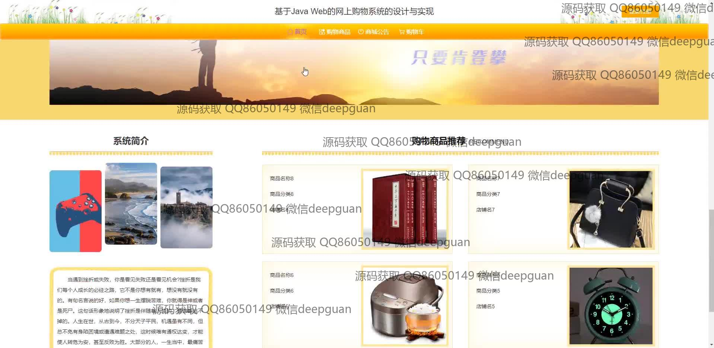
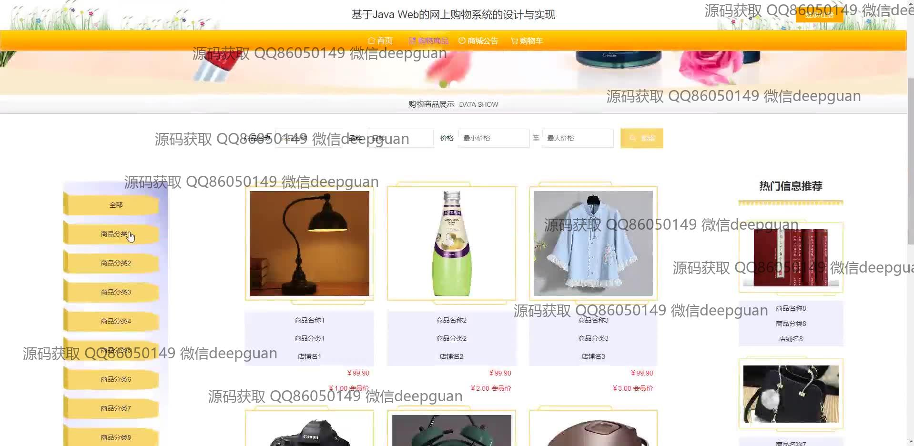
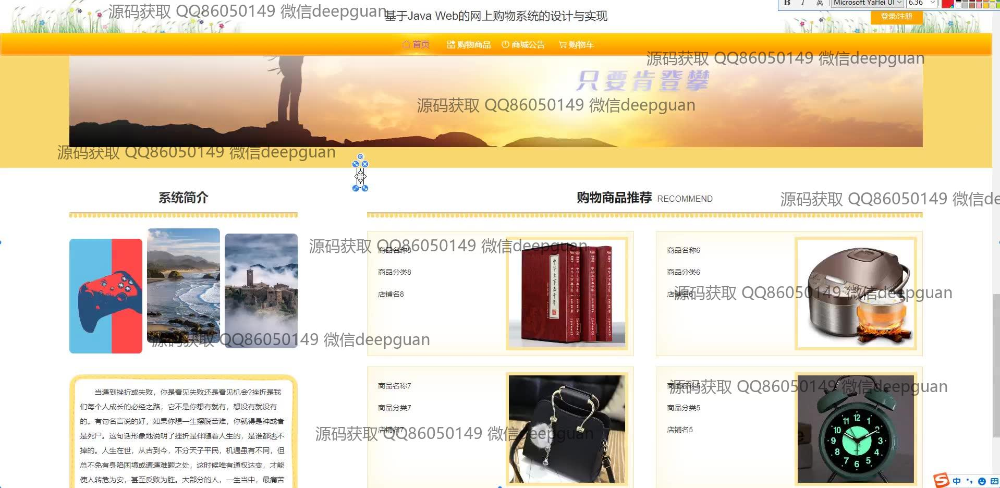
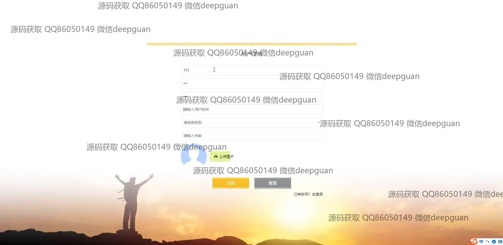
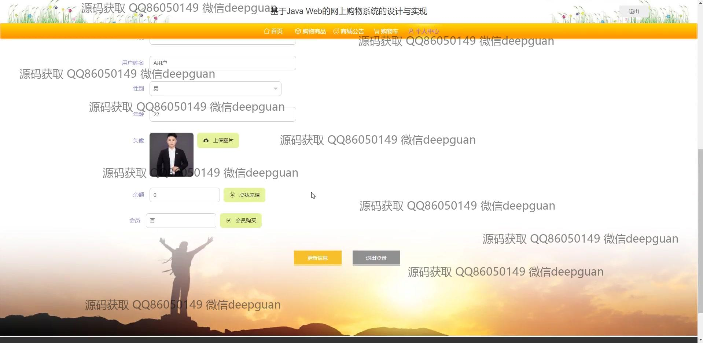

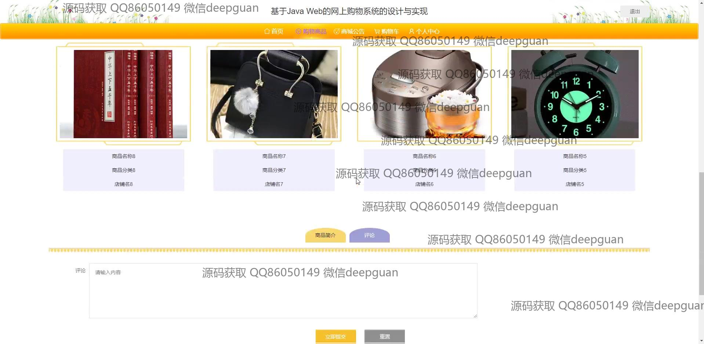

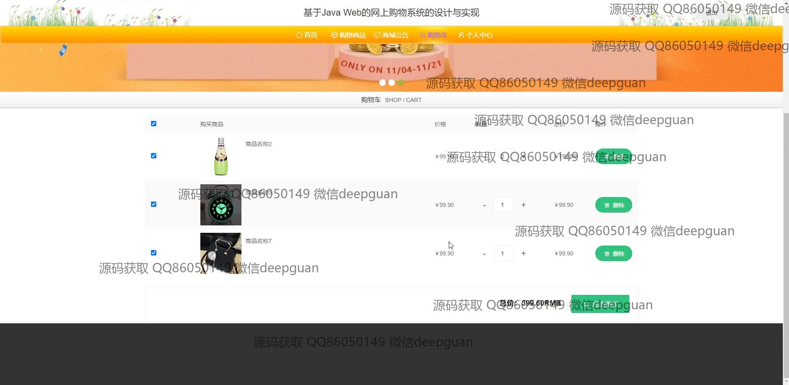

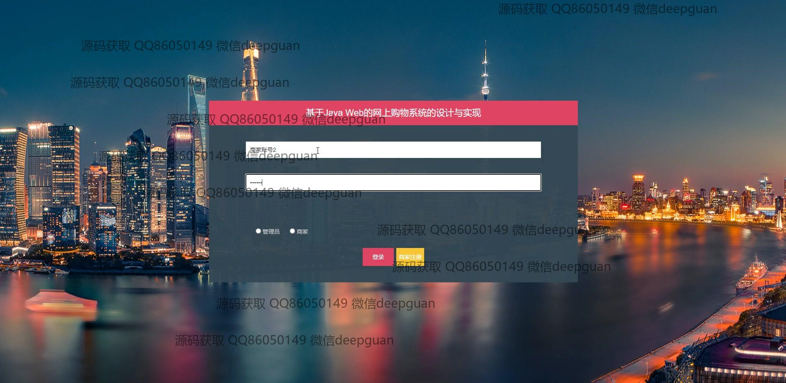
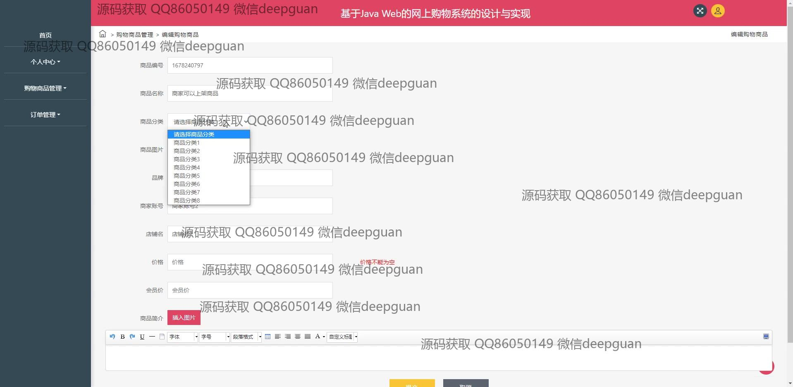
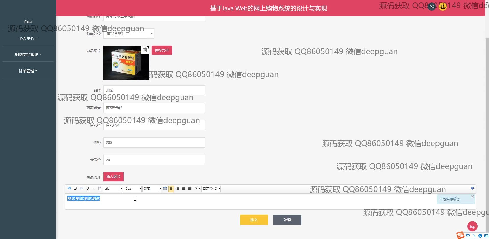
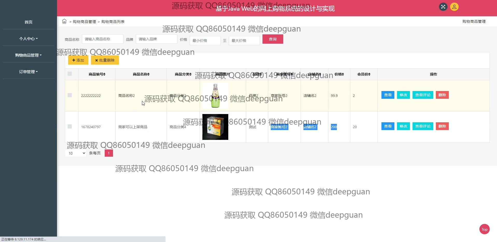
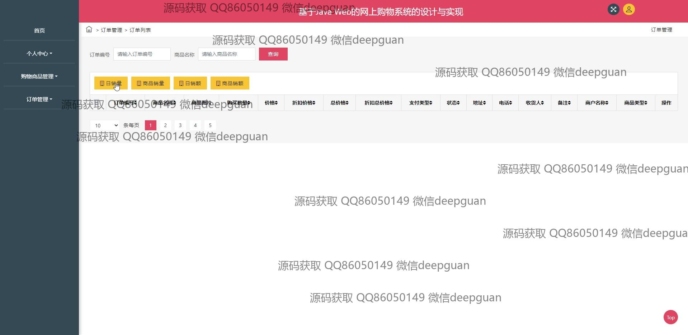
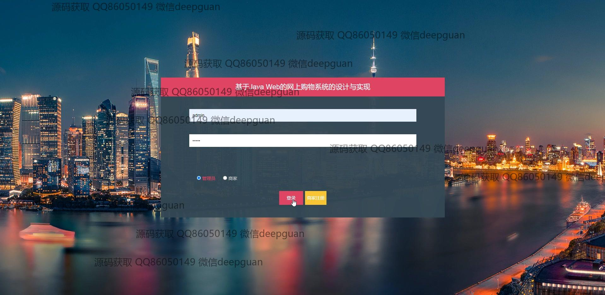
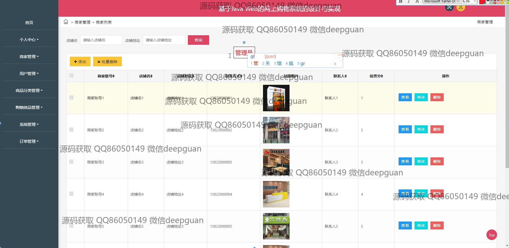
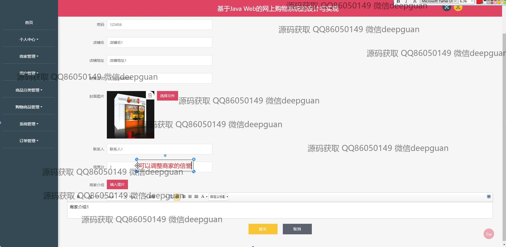
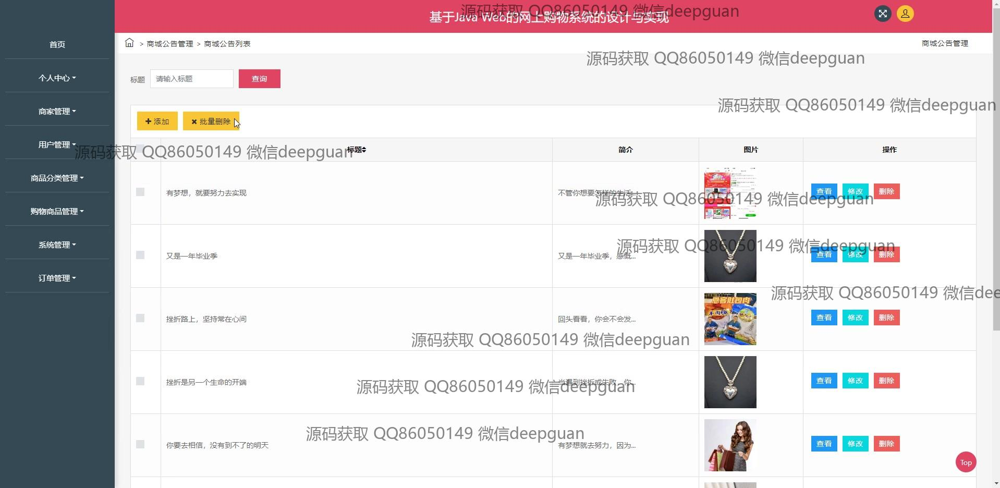
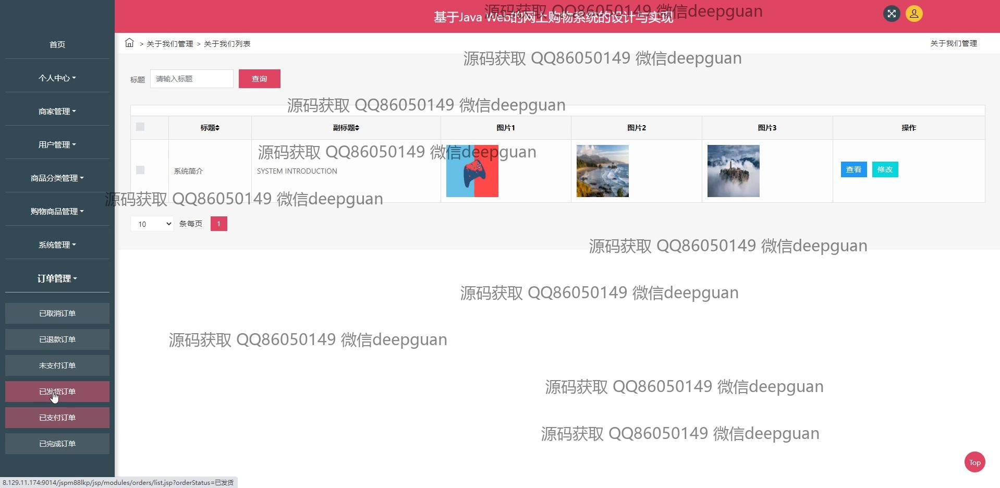

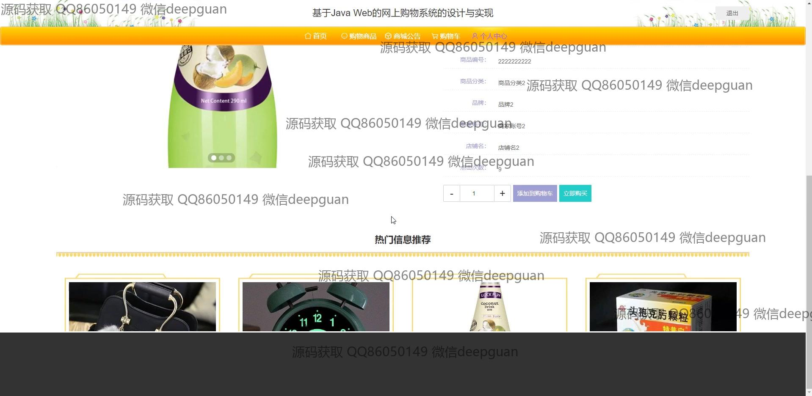
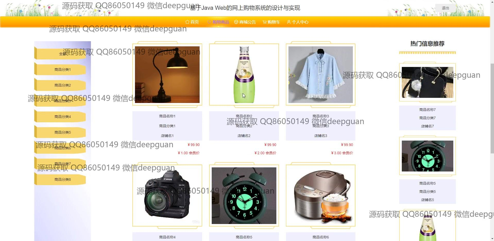
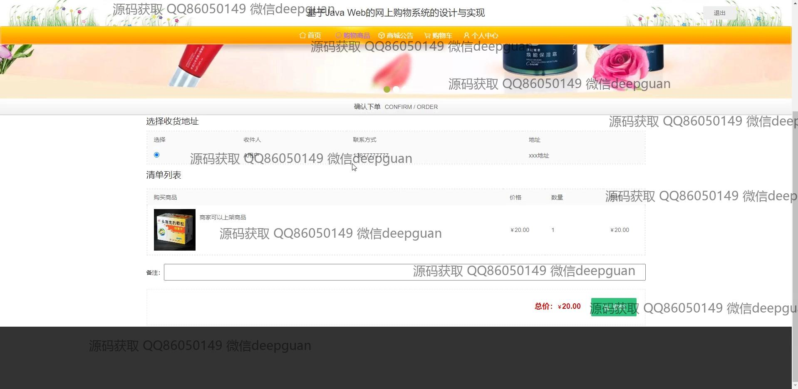

本代码来源于网络,仅供学习参考使用!

